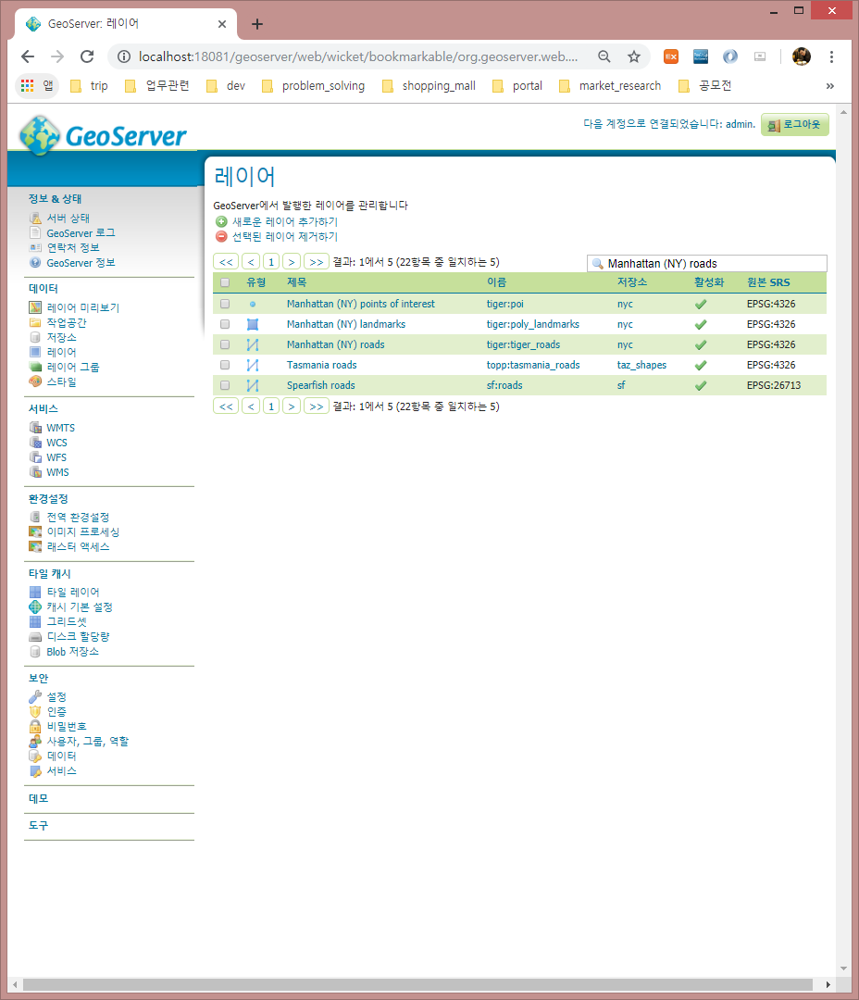
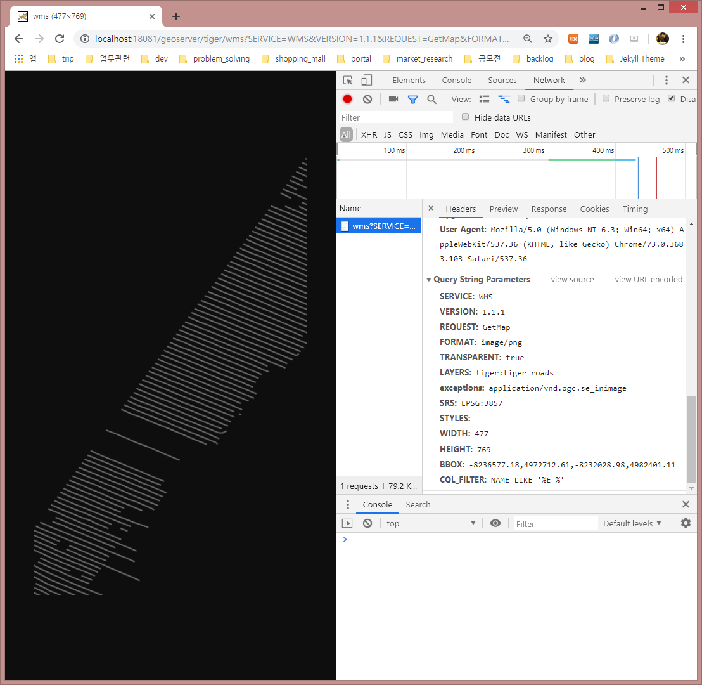

# Geoserver WMS, WFS 동적 좌표계 설정 및 CQL필터 적용하기

## 제약사항
|                               | WMS                                                                           | WFS                                                                             |
|-------------------------------|-------------------------------------------------------------------------------|---------------------------------------------------------------------------------|
| 동적 SRS 설정                 | 가능함                                                                        | 필터조건에는 적용안됨 검색결과에는 적용가능                                     |
| 기본 CQL 필터                 | 사용가능                                                                      | 사용가능                                                                        |
| 공간검색 CQL 필터             | Native SRS와 동일하면 사용가능                                                | Declared SRS와 동일하면 사용가능                                                |
| 반경검색에 Meter단위 사용여부 | Native SRS가 투영좌표계면 가능(만약 EPSG:4326이면 미터를 Degree로 환산해야 함)  | Declared SRS가 투영좌표계면 가능(만약 EPSG:4326이면 미터를 Degree로 환산해야 함) |

WFS에 대한 동적 SRS 설정이 완전히 불가능한 것은 아님.  
다음 예시와 같이 BBOX에 좌표계를 설정할 수 있음  
ex> bbox=126.87932373,37.40620619,126.87932373,37.50620619,urn:ogc:def:crs:EPSG:4326  


## WMS 동적 좌표계 설정 및 CQL필터 적용하기
__Geoserver 샘플레이어인 tiger:tiger_roads 레이어를 이용하여 테스트를 진행함__

01. 테스트 대상 레이어 Native SRS 확인


02. Native SRS(EPSG:4326)에 CQL필터 적용후 WMS 요청하기
```
http://localhost:18081/geoserver/tiger/wms?SERVICE=WMS&VERSION=1.1.1&REQUEST=GetMap&FORMAT=image%2Fpng&TRANSPARENT=true&LAYERS=tiger%3Atiger_roads&exceptions=application%2Fvnd.ogc.se_inimage&SRS=EPSG%3A4326&STYLES=&WIDTH=477&HEIGHT=769&BBOX=-73.99043172600746,40.730780661077496,-73.94957453009606,40.796700418024066&CQL_FILTER=NAME%20LIKE%20%27%25E%20%25%27
```


03. EPSG:3857로 좌표계를 변경하고 CQL필터 적용후 WMS 요청하기
```
http://localhost:18081/geoserver/tiger/wms?SERVICE=WMS&VERSION=1.1.1&REQUEST=GetMap&FORMAT=image%2Fpng&TRANSPARENT=true&LAYERS=tiger%3Atiger_roads&exceptions=application%2Fvnd.ogc.se_inimage&SRS=EPSG%3A3857&STYLES=&WIDTH=477&HEIGHT=769&BBOX=-8236577.18,4972712.61,-8232028.98,4982401.11&CQL_FILTER=NAME%20LIKE%20%27%25E%20%25%27
```

