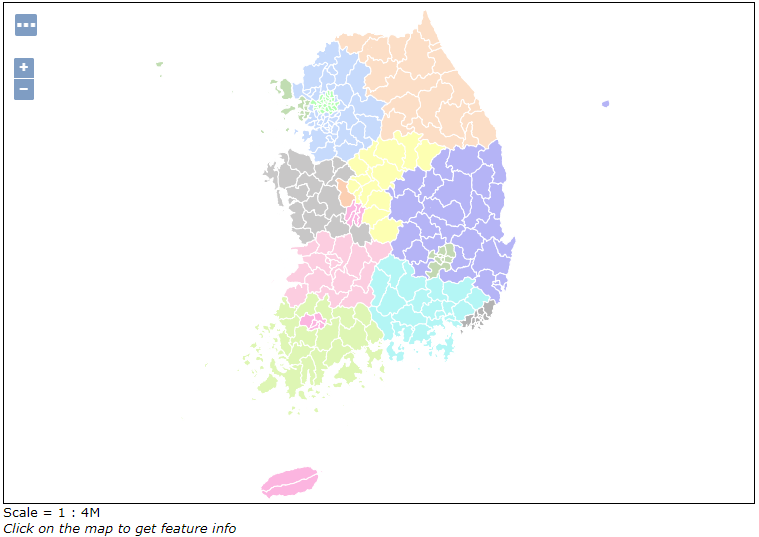
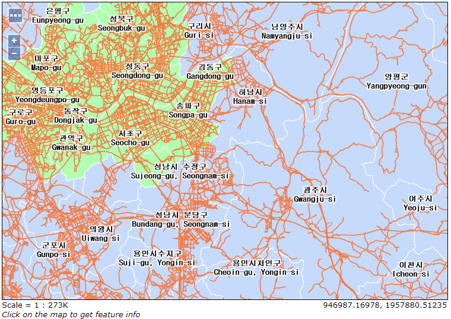
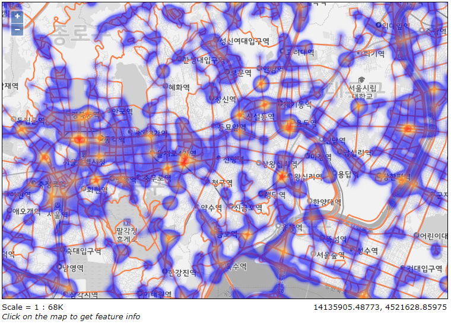

# Layer Group-01
시군구(폴리곤) + 표준링크(라인) + 표준노드(포인트) 데이터를 이용한 Layer Group 생성 및 스타일링  

## 01. 샘플 데이터 출처
| NO | 데이터 종류 | 공간데이터 타입 |                            출처                            |
|:--:|:-----------:|:---------------:|:----------------------------------------------------------:|
|  1 | 시군구 경계 |     Polygon     | http://www.gisdeveloper.co.kr/?p=2332                      |
|  2 |   표준링크  |       Line      | http://nodelink.its.go.kr/data/data01_view.aspx?Fileno=124 |
|  3 |   표준노드  |      Point      | http://nodelink.its.go.kr/data/data01_view.aspx?Fileno=124 |

## 02. Demo Screenshots
### 시군구(폴리곤)   
  

### 시군구(폴리곤)
  

### 시군구(폴리곤) + 표준링크(라인)  
  

### 시군구(폴리곤) + 표준링크(라인) + 표준노드(포인트)  
  

### VWorld + 표준링크(라인) + 표준노드 Heatmap
  

## 03. Shp file Oracle Saptial에 Import하기

## 04. 

## 05. 
