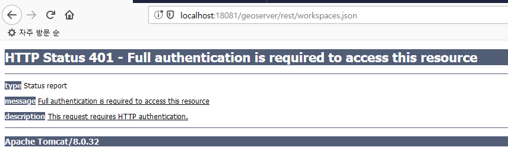
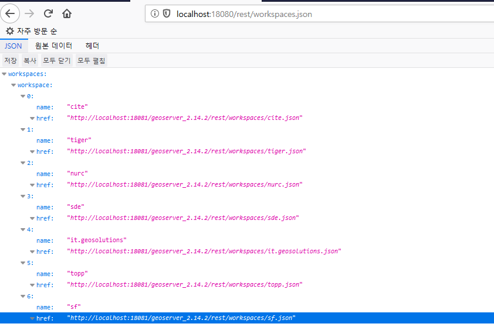

# Geoserver rest 서비스용 HTTP 기본인증 처리 Proxy 만들기 
클라이언트가 Geoserver의 인증프로세스를 사용하지 않고 별도의 인증프로세스를 사용해야 하는경우 적용 가능함. 
물론 CORS 설정만 되어있다면 클라이언트에서도 직접 인증처리를 할 수 있음.  
클라이언트에서 직접 인증 처리를 하고 싶다면 아래 링크를 참고하면 됨.  
https://stackoverflow.com/questions/5507234/use-basic-authentication-with-jquery-and-ajax

## 01. Geoserver rest 목록  
https://docs.geoserver.org/stable/en/user/rest/

## 02. Geoserver rest 주요 Endpoint
| 최상위 호출 URL                                      |
|------------------------------------------------------|
| /rest/workspaces                                     |
| /rest/layergroups                                    |
| /rest/layers                                         |
| /rest/styles                                         |  

| 워크스페이스 하위 호출 URL                                         |
|------------------------------------------------------|
| /rest/workspaces/{layergroupName}/layergroups        |
| /rest/workspaces/{layergroupName}/layers             |
| /rest/workspaces/{layergroupName}/layers/{layerName} |

## 03. Spring-Boot를 이용한 간단한 Proxy처리용 컨트롤러 만들기
BasicAuthentication.java
```
package geoserver.rest.helper;

import java.io.BufferedReader;
import java.io.IOException;
import java.io.InputStream;
import java.io.InputStreamReader;
import java.net.HttpURLConnection;
import java.net.URL;
import java.util.Base64;

public class BasicAuthentication {

    public static void main(String[] args) {
        System.out.println(requestBasicAuth("http://localhost:18081/geoserver_2.14.2/rest/", "workspaces.json", "admin", "geoserver"));
    }
    
    public static String requestBasicAuth(String baseUrl, String resource, String id, String password) {
    	StringBuilder sb = new StringBuilder();
    	InputStream content = null; 
    	
    	try {
            URL url = new URL(baseUrl + resource);
            
            byte[] tokenArray  = (id + ":" + password).getBytes("UTF-8");
            String encoding = Base64.getEncoder().encodeToString(tokenArray);

            HttpURLConnection connection = (HttpURLConnection)url.openConnection();
            connection.setRequestMethod("GET");
            connection.setDoOutput(true);
            connection.setRequestProperty  ("Authorization", "Basic " + encoding);
            content = (InputStream)connection.getInputStream();
            BufferedReader in = new BufferedReader (new InputStreamReader(content));
            String line;
            while ((line = in.readLine()) != null) {
                sb.append(line);
            }
        } catch(Exception e) {
            e.printStackTrace();
        } finally {
			if (content != null)
				try {
					content.close();
				} catch (IOException e) {
					e.printStackTrace();
				}
		}
    	
    	return sb.toString();
    }
}
```

RestController.java
```
@RequestMapping(path="/rest/{endpoint}", produces=MediaType.APPLICATION_JSON_VALUE)
@ResponseBody
public String restProxyRoot(HttpServletRequest request, @PathVariable String endpoint) throws IOException {
    System.out.println(endpoint);
    String result = BasicAuthentication.requestBasicAuth("http://localhost:18081/geoserver_2.14.2/rest/", endpoint, "admin", "geoserver");
    return result;
}
```

## 04. Geoserver REST 호출 테스트
  

## 05. Geoserver Proxy REST 호출 테스트
  
