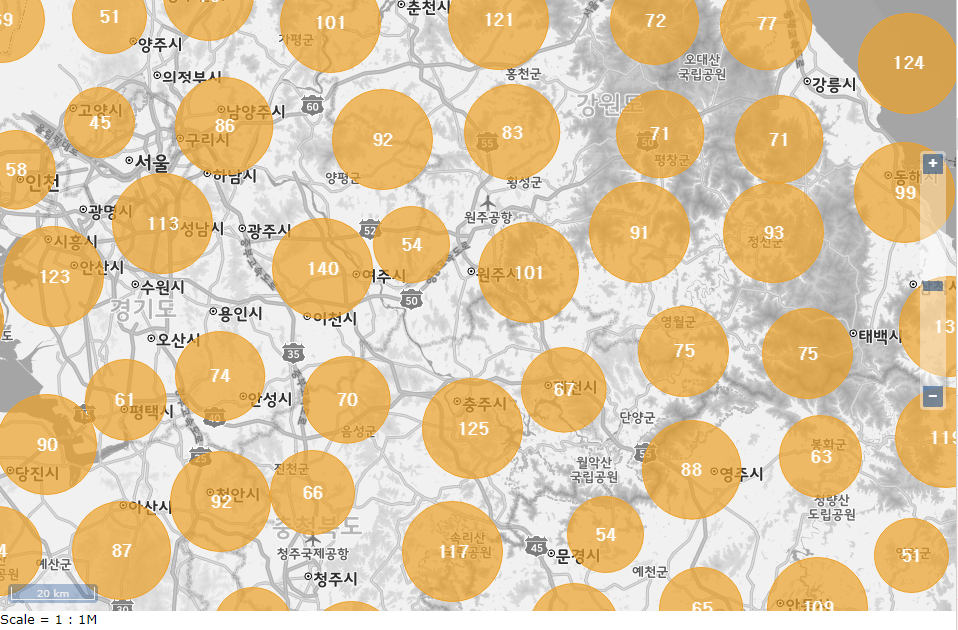
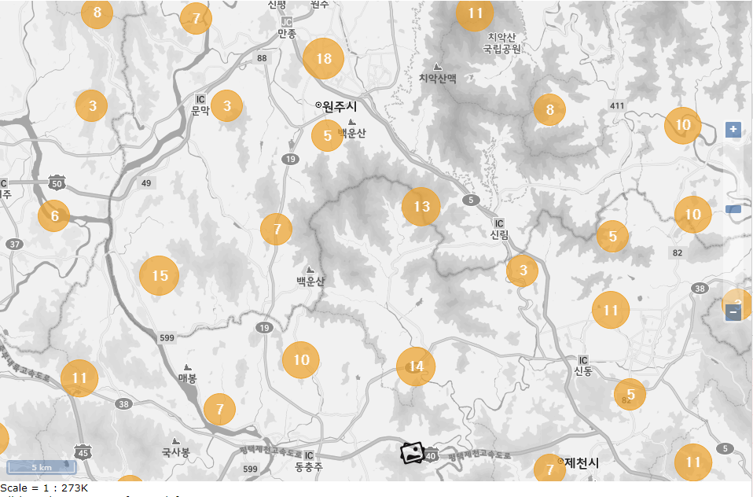
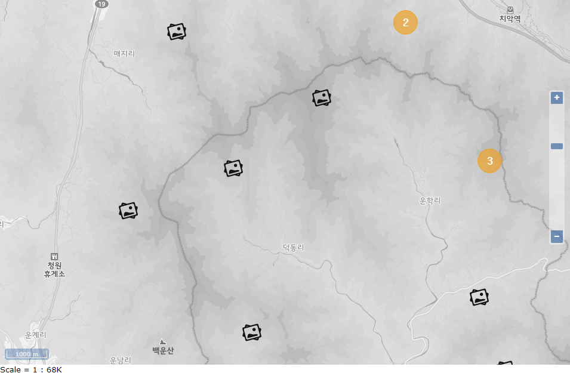

# Openlayers Cluster Marker 만들기
  
  
  

## 01. Random Point Feature 생성
```
var count = 10000;
var features = new Array(count);
var x = 14226719;
var y = 4410991;
var magicNumber = 200000;
for (var i = 0; i < count; ++i) {
    var coordinates;
    if (i % 4 == 0) {
        coordinates = [x + (Math.random() * magicNumber * -1), y + (Math.random() * magicNumber)];
    } else if (i % 4 == 1) {
        coordinates = [x + (Math.random() * magicNumber), y + (Math.random() * magicNumber * -1)];
    } else if (i % 4 == 2) {
        coordinates = [x + (Math.random() * magicNumber * -1), y + (Math.random() * magicNumber * -1)];
    } else if (i % 4 == 3) {
        coordinates = [x + (Math.random() * magicNumber), y + (Math.random() * magicNumber)];
    }
    features[i] = new ol.Feature(new ol.geom.Point(coordinates));
    features[i].setId('feature-seq-' +  i);
}
```

## 02. Cluster source 생성
```
var clusterSource = new ol.source.Cluster({
    distance: 100,
    source: new ol.source.Vector({
        features: features
    })
});
```

## 03. Cluster Layer 생성 및  Style 설정 
```
var styleCache = {};
var clusters = new ol.layer.Vector({
    source: clusterSource,
    style: function(feature, resolution) {
        var size = feature.get('features').length;
        var style = styleCache[size];
        var radius = -1; 
        if (size < 10) {
            radius = 20;
        } else {
            radius = 20 + (size / 3);
            if (radius > 50) radius = 50;
        } 
        
        if (!style && size > 1) {
            style = [new ol.style.Style({
                image: new ol.style.Circle({
                    radius: radius,
                    stroke: new ol.style.Stroke({
                        color: 'rgba(237, 161, 42, 1)',
                        width: 1
                    }),
                    fill: new ol.style.Fill({
                        color: 'rgba(237, 161, 42, 0.7)'
                    })
                }),
                text: new ol.style.Text({
                    text: size.toString(),
                    fill: new ol.style.Fill({
                        color: '#fff'
                    }),
                    font: 'bold 18px gulim'
                })
            })];
            styleCache[size] = style;
        } else if (!style && size == 1) {
            style = [new ol.style.Style({
                image: new ol.style.Icon({
                    anchor: [0.5, 0.5],
                    anchorXUnits: 'fraction',
                    anchorYUnits: 'fraction',
                    src: './images/photo-32.png'
                })
            })];
            styleCache[size] = style;
        }
        return style;
    }
});
```

## 04. Layer 추가
```
map.addLayer(clusters)
```

## 05. Cluster 클릭이벤트 등록 
```
map.on('singleclick', function(evt) {
    console.log(evt)
    var feature_;
    map.forEachFeatureAtPixel(evt.pixel, function(feature, layer) { 
        var features = feature.get('features');
        if (features) {
            console.log('cluster feature: ' + features.length);
            features.forEach(function(item) {
               console.log(item.getId()); 
            });
        }
    });
});
```
