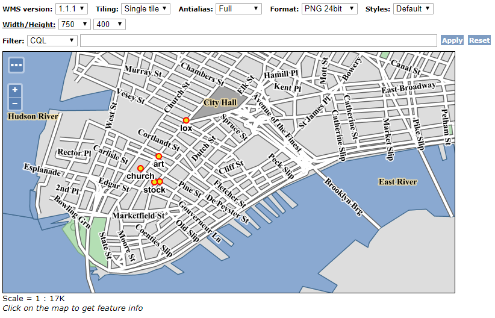
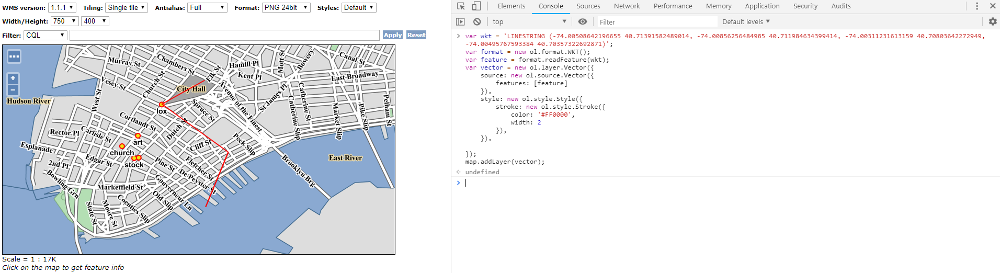
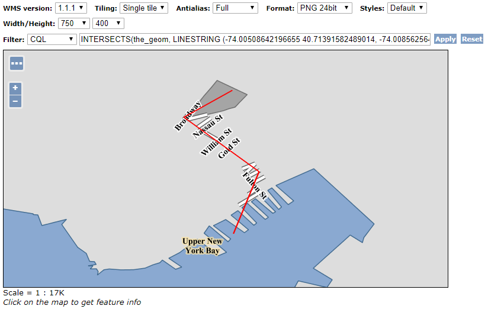
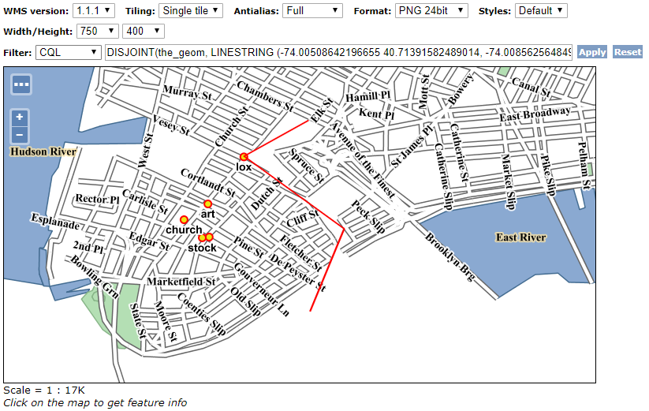

# CQL Filter 테스트하기
sample layer group인 tiger-ny layer를 이용한 CQL 테스트하기

## 01. geoserver layer preview에서 tiger-ny layer를 OpenLayers viewer로 열기
좌상단에 Toggle options toolbar 아이콘을 클릭해서 CQL필터 활성화  


## 02. 테스트에 사용할 LINESTRING WKT Layer를 Browser Console에서 추가
```
// 다음 스크립트를 실행하면 흰색 Layer가 추가됨
var wkt = 'LINESTRING (-74.00508642196655 40.71391582489014, -74.00856256484985 40.711984634399414, -74.00311231613159 40.70803642272949, -74.00495767593384 40.70357322692871)';
var format = new ol.format.WKT();
var feature = format.readFeature(wkt);
var vector = new ol.layer.Vector({
    source: new ol.source.Vector({
        features: [feature]
    }),
    style: new ol.style.Style({
        stroke: new ol.style.Stroke({
            color: '#FF0000',
            width: 2
        }),
    }),

});
map.addLayer(vector);
```  


## 03. INTERSECTS 테스트
INTERSECTS(the_geom, LINESTRING (-74.00508642196655 40.71391582489014, -74.00856256484985 40.711984634399414, -74.00311231613159 40.70803642272949, -74.00495767593384 40.70357322692871))  


## 04. DISJOINT 테스트
DISJOINT(the_geom, LINESTRING (-74.00508642196655 40.71391582489014, -74.00856256484985 40.711984634399414, -74.00311231613159 40.70803642272949, -74.00495767593384 40.70357322692871))  


## ~05. DWITHIN 테스트~
SRS가 EPSG:4326인 경우 <span style="color:red">meters, kilometers unit을 지원하지 않는 이슈 있음</span>  
tiger-ny Layer의 경우 SRS가 EPSG:4326 이므로 TM 좌표로 reprojection하거나 distance값을 degree값으로 입력해야 함
DWITHIN(the_geom, LINESTRING (-74.00508642196655 40.71391582489014, -74.00856256484985 40.711984634399414, -74.00311231613159 40.70803642272949, -74.00495767593384 40.70357322692871), ~100, meters~)

## 06. 참고링크
https://docs.geoserver.org/stable/en/user/filter/ecql_reference.html
https://stackoverflow.com/questions/45333651/geoserver-dwithin-not-filtering-points-correctly
https://en.wikipedia.org/wiki/Decimal_degrees


