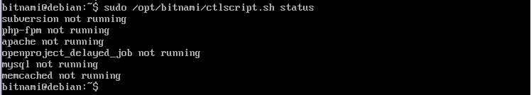
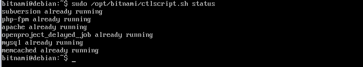
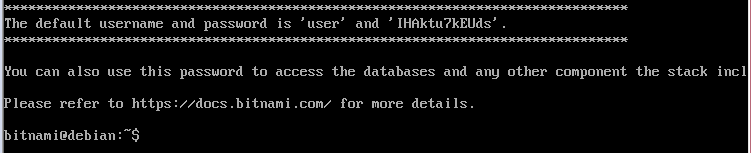
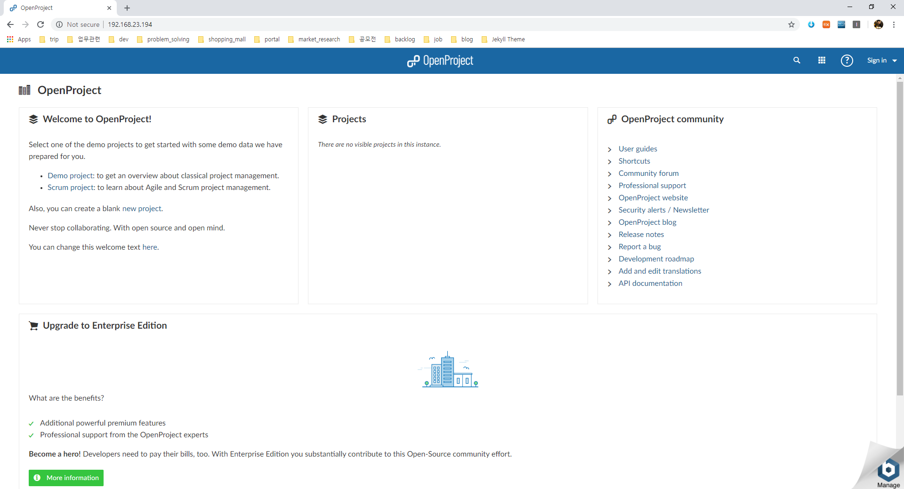

# Openproject Virtual Machine에 설치하기

## bitnami openproject image 다운로드
https://bitnami.com/stack/openproject/virtual-machine

## bitnami openproject 온라인 매뉴얼
https://docs.bitnami.com/virtual-machine/apps/openproject/get-started/first-steps/

## Openproject 실행
https://docs.bitnami.com/virtual-machine/apps/openproject/administration/control-services/
```
서비스 상태확인
sudo /opt/bitnami/ctlscript.sh status
```


```
서비스 시작
sudo /opt/bitnami/ctlscript.sh start
```


```
서비스 상태확인
sudo /opt/bitnami/ctlscript.sh status
```


## 관리계정 확인
```
cat /home/bitnami/bitnami_credentials
```


## 접속 및 로그인


